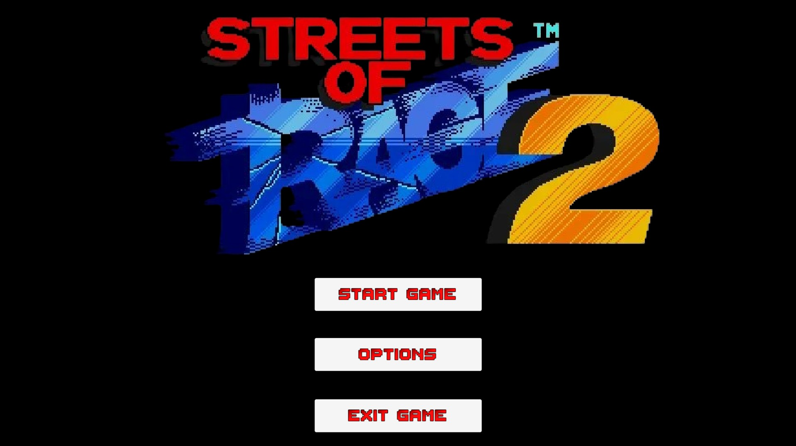
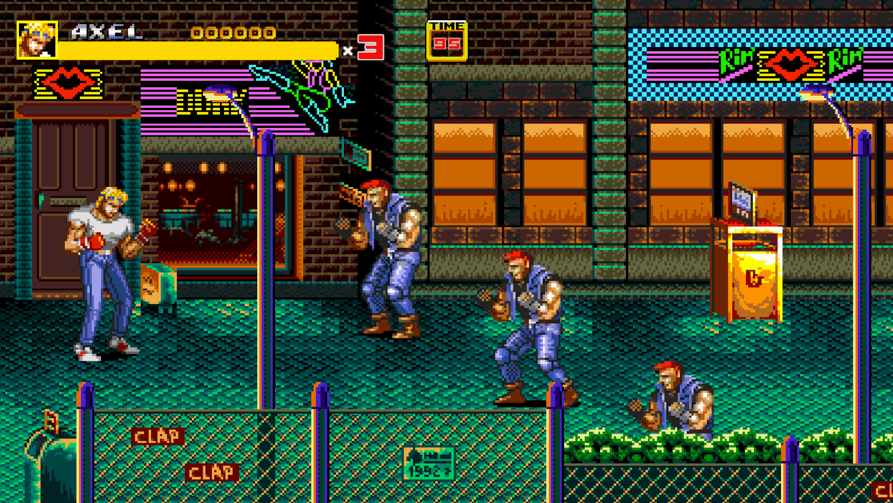

# 🥊 Streets of Rage 2 — Fan Remake en Unity

> Remake no oficial del clásico arcade **Streets of Rage 2** (Sega, 1992), desarrollado en **Unity 6** como proyecto académico y de portfolio personal.  
> *Unofficial fan remake of the classic arcade Streets of Rage 2 (Sega, 1992), built in Unity 6 as an academic and personal portfolio project.*

---

## 📸 Capturas de pantalla / Screenshots

### Main Menu



| Stage 1-1 | Stage 1-2 | Credits |
|-----------|-----------|--------|
|  |  |  |

---

## 🕹️ Descripción / Description

**ES** — Este proyecto es una recreación funcional del **Stage 1** de Streets of Rage 2, implementando los sistemas principales del juego original: movimiento pseudo-3D, sistema de combate por combos, enemigos con IA, objetos rompibles, sistema de puntuación, vidas, temporizador y pantalla de Game Over/Continue. El proyecto ha sido desarrollado íntegramente en C# con Unity 6 como práctica avanzada de programación de videojuegos 2D.

**EN** — This project is a functional recreation of **Stage 1** from Streets of Rage 2, implementing the core systems of the original game: pseudo-3D movement, combo combat system, enemy AI, breakable objects, score system, lives, timer, and Game Over/Continue screen. Developed entirely in C# with Unity 6 as an advanced 2D game programming exercise.

---

## ✨ Características implementadas / Features

### 🎮 Jugabilidad / Gameplay
- Movimiento pseudo-3D libre en X e Y (sin física real, como el original)
- Sistema de combos encadenados: **Punch → Kick → HighKick**
- Ataques especiales: **Special1**, **Special2** (consumen vida), **Gancho** (doble tap + ataque)
- Ataques aéreos: **JumpKick** y **JumpHighKick**
- Salto con arco senoidal estilo SOR2
- Sistema de knockdown al recibir 3 golpes seguidos
- Invulnerabilidad temporal tras reaparecer
- Reaparición cayendo desde el cielo con knockdown de enemigos cercanos

### 👊 Sistema de combate / Combat system
- Hitbox activo solo durante el frame de golpe (sin colisiones continuas falsas)
- Detección de solapamiento al activar el hitbox (enemies estáticos también reciben daño)
- Daño diferenciado por tipo de ataque
- Special1/Special2 bloquean si el jugador tiene ≤8% de vida
- Objetos rompibles con animación de rotura, fade y spawn de drops

### 🤖 Enemigos / Enemies
- Arquitectura de herencia: `EnemyBase` → `EnemyGalsia`, `EnemyJack`, `EnemyYSignal`, `EnemyDonovan`, `EnemyBossBarbon`
- IA con persecución pseudo-3D: primero alinea en Y, luego persigue en X
- Ataques desincronizados aleatoriamente para evitar patrones repetitivos
- Caída al suelo con animación ante golpes de daño ≥2
- Animación **StandUp** si el enemigo sobrevive la caída
- **Enemy_Jack**: mini-boss con dos fases (puños → cuchillo), animación de transición de fase
- **Boss Barbon**: tres tipos de ataque con probabilidades distintas, música propia al detectar al player

### 📺 HUD / UI
- Barra de vida del jugador estilo SOR2: amarilla (actual) + roja con delay (daño reciente)
- Puntuación en tiempo real (6 dígitos)
- Temporizador a mitad de velocidad real
- Contador de vidas
- Barra de vida del enemigo activo con icono y nombre (desaparece a los 5s sin recibir golpes)
- Panel de Game Over y Continue con cuenta atrás
- Panel de Stage Clear con desglose de bonificaciones
- Pantalla de créditos con puntuación total y sprites animados

### 🎯 Sistemas de juego / Game systems
- Sistema de puntuación completo (golpes, enemigos, objetos, bonus de nivel)
- Vida extra cada 30.000 puntos con sonido
- Sistema de Continue con 3 oportunidades
- Timer que se reinicia a 99 al agotar el tiempo (la vida no se reinicia)
- Persistencia de puntuación y vida entre escenas mediante `PlayerPrefs`
- SpawnPoints configurables con delay entre enemigos y encadenamiento de zonas
- Intro del Boss Barbon: barman animado que huye antes de aparecer el boss en combate
- Transición de nivel con panel de puntuación y carga de siguiente escena

### 📷 Cámara / Camera
- Cinemachine con extensión custom `CinemachinePositionClamp`
- Límites de cámara por zonas con interpolación suave
- Sorting dinámico por Y (`SortByY`) para correcto orden de dibujado pseudo-3D

---

## 🗂️ Estructura del proyecto / Project structure

```
Assets/
├── Anim/
│   ├── Enemies/          # Animadores y clips de enemigos
│   ├── Misc/             # Barman, mesas, efectos
│   └── Players/          # Animaciones de Axel
├── Audio/
│   ├── Music/            # Música de fondo y boss
│   └── SFX/              # Efectos de sonido
├── Prefab/
│   ├── Enemies/          # Prefabs de enemigos
│   ├── Items/            # Objetos recogibles y rompibles
│   └── Player/           # Prefab del jugador
├── Scenes/
│   ├── Stage 1-1         # Primera parte del nivel
│   ├── Stage 1-2         # Segunda parte con boss
│   └── Credits           # Pantalla de créditos
├── Scripts/
│   ├── AttackHitbox.cs
│   ├── AudioManager.cs
│   ├── BarmanIntro.cs
│   ├── BreakableObject.cs
│   ├── CinemachinePositionClamp.cs
│   ├── CreditsController.cs
│   ├── EnemyBase.cs
│   ├── EnemyBossBarbon.cs
│   ├── EnemyDonovan.cs
│   ├── EnemyGalsia.cs
│   ├── EnemyHitbox.cs
│   ├── EnemyHPBar.cs
│   ├── EnemyJack.cs
│   ├── EnemySpawnPoint.cs
│   ├── EnemyYSignal.cs
│   ├── GameManager.cs
│   ├── LevelManager.cs
│   ├── Obstacle2D.cs
│   ├── Pickable.cs
│   ├── PlayerController.cs
│   ├── SortByY.cs
│   └── KnifeProjectile.cs
└── Sprites/
    ├── Background/
    ├── Enemies/
    └── Players/
```

---

## 🎮 Controles / Controls

| Acción / Action | Tecla / Key |
|-----------------|-------------|
| Mover / Move | `WASD` / Flechas - Arrows |
| Saltar / Jump | `Espacio / Space` |
| Golpear / Attack | `P` o `Z (Fire1)` |
| Special 1 | `O` |
| Special 2 | `I` |
| Gancho (doble tap + ataque) | `→→ + P` ó `←← + P` |
| JumpKick (en el aire) | `Espacio` → `P` |
| JumpHighKick (en el aire con dirección) | `Espacio + dirección` → `P` |

---

## 🛠️ Tecnologías / Tech stack

- **Motor:** Unity 6 (6000.0.67f1)
- **Lenguaje:** C#
- **Paquetes:** Cinemachine, TextMeshPro, 2D Animation
- **Control de versiones:** Git + Unity VCS
- **Arte:** Sprites extraídos de SpriteRenderer.com - Streets of Rage 2 (Sega, 1992) (solo con fines educativos)

---

## ▶️ Cómo ejecutar / How to run

**ES**
1. Clona el repositorio: `git clone https://github.com/Prouly/StreetsOfRage2.git`
2. Abre el proyecto con **Unity 6** (versión 6000.0.67f1 o superior)
3. Abre la escena `Assets/Scenes/MainMenu` desde el Project panel
4. Pulsa **Play** en el Editor, o juega desde la build  `Assets/Builds`

**EN**
1. Clone the repository: `git clone https://github.com/Prouly/StreetsOfRage2.git`
2. Open the project with **Unity 6** (version 6000.0.67f1 or higher)
3. Open the scene `Assets/Scenes/MainMenu` from the Project panel
4. Press **Play** in the Editor, or run build from `Assets/Builds`

---

## 📋 Estado del proyecto / Project status

| Sistema / System | Estado / Status |
|-----------------|-----------------|
| Movimiento pseudo-3D | ✅ Completado |
| Sistema de combos | ✅ Completado |
| Ataques especiales | ✅ Completado |
| IA de enemigos | ✅ Completado |
| Boss Barbon | ✅ Completado |
| HUD completo | ✅ Completado |
| Stage 1-1 | ✅ Completado |
| Stage 1-2 | ✅ Completado |
| Pantalla de créditos | ✅ Completado |
| Sistema de audio | ✅ Completado |
| Guardado entre escenas | ✅ Completado |

---

## ⚖️ Licencia y créditos / License & credits

**ES** — Este proyecto es un **fan remake no comercial** creado con fines educativos y de portfolio. Los sprites, música y demás assets visuales/sonoros pertenecen a **Sega** y a los autores originales de Streets of Rage 2. Este proyecto no tiene ninguna afiliación con Sega ni pretende sustituir al juego original.

Si Sega o cualquier titular de derechos solicita la retirada del contenido, será atendida de inmediato.

**EN** — This project is a **non-commercial fan remake** created for educational and portfolio purposes. Sprites, music and other visual/audio assets belong to **Sega** and the original Streets of Rage 2 authors. This project has no affiliation with Sega and does not intend to replace the original game.

If Sega or any rights holder requests removal of content, it will be addressed immediately.

---

> *Desarrollado con ❤️ por Álvaro Muñoz Adán · [2026]*  
> *"Bare Knuckle" spirit lives on.*
